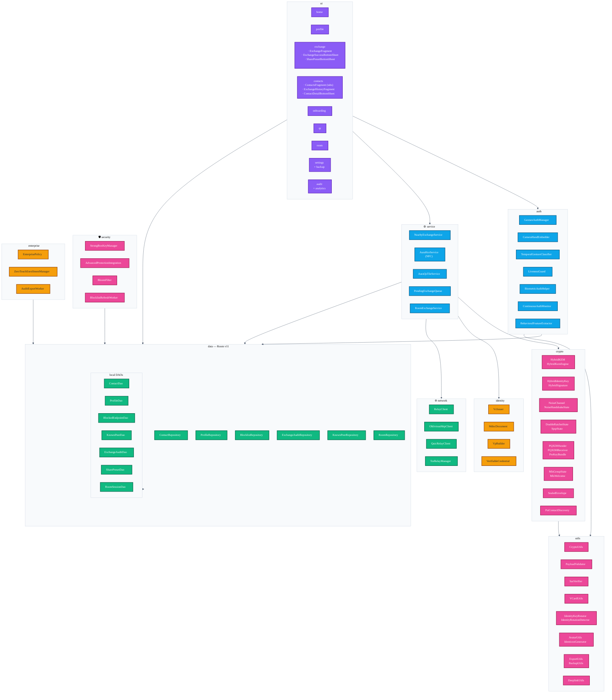
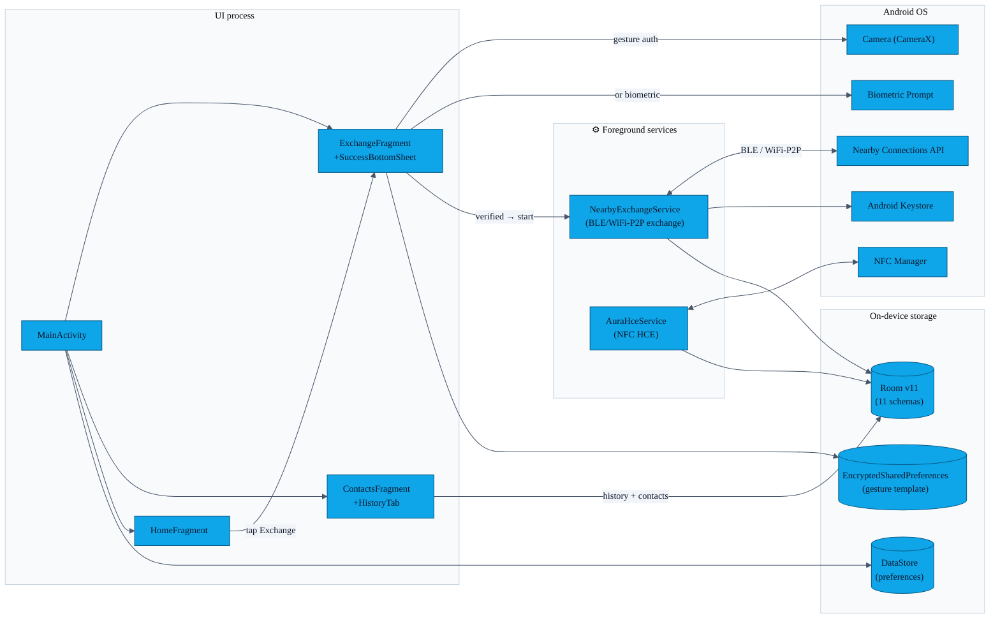
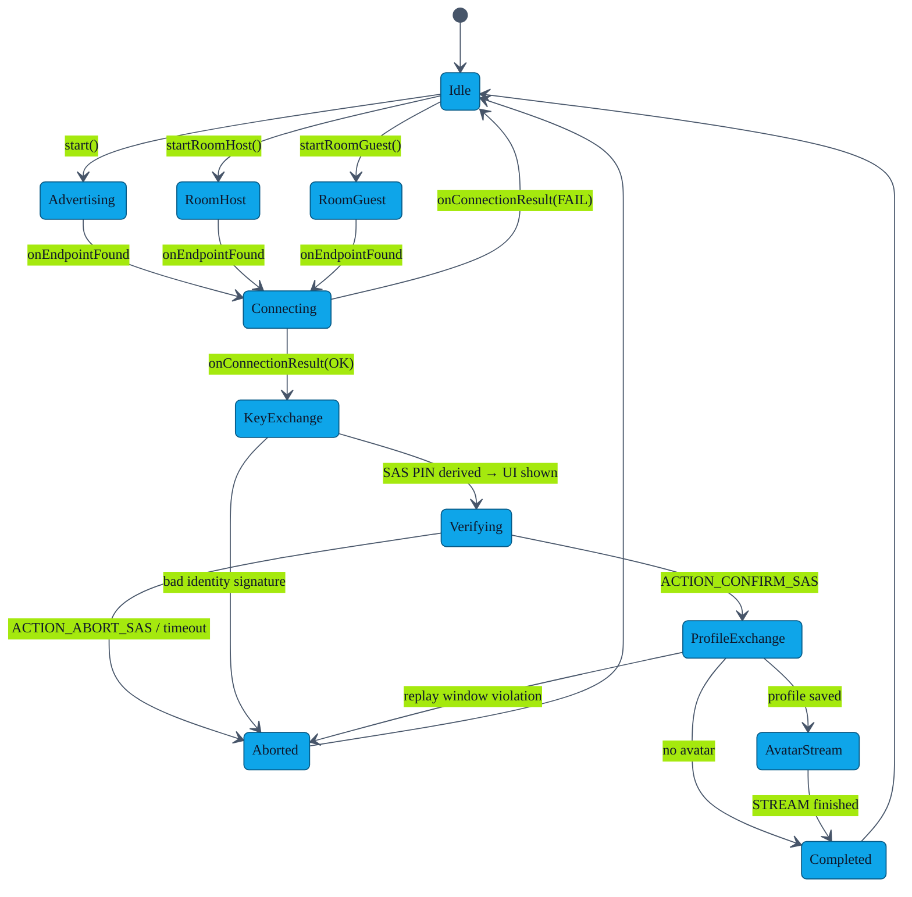
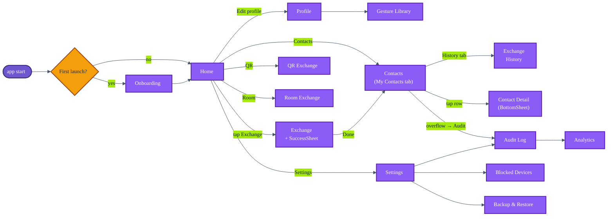

# Architecture

> AURA is a single-module Android app with a strict **UI → ViewModel → Repository → DAO** dependency flow. One long-lived foreground service (`NearbyExchangeService`) manages the Bluetooth/Wi-Fi P2P exchange session; a second foreground service (`AuraHceService`) handles NFC Host Card Emulation. Activation is in-app — the user opens AURA and taps Exchange.

---

## 1. Package map

### Dependency-direction rules

1. **`ui` may depend on anything below it** but never on another `ui/*` sub-package directly — use NavController actions.
2. **`service` does not depend on `ui`** — it emits state via `NearbyExchangeService.sessionState: StateFlow<ExchangeSession?>` which fragments collect.
3. **`data/local` knows nothing about Android UI** — no `androidx.fragment` imports.
4. **`utils` is pure-Kotlin / JVM-testable** wherever possible. `CryptoUtils`, `PayloadValidator`, `SasVerifier`, `VCardUtils` are covered by `app/src/test` unit tests.
5. **`model` has zero outbound deps** — plain data classes and Room `@Entity`.

---

## 2. Runtime component diagram

### Services

| Service | `foregroundServiceType` | Why foreground |
|---|---|---|
| `NearbyExchangeService` | `connectedDevice` | Holds a BLE / Wi-Fi P2P connection; Android 12+ requires `FOREGROUND_SERVICE_CONNECTED_DEVICE` to keep it alive |
| `AuraHceService` | n/a (bound by NFC Manager) | System-bound via the APDU service descriptor in the manifest; no persistent foreground notification needed |

---

## 3. Exchange service state machine

`NearbyExchangeService` is the security-critical hot path. Internally it is a typed state machine over `ExchangeSession.State`:

### Wire message types

| `MSG_TYPE` | Body |
|---|---|
| `PUBLIC_KEY` / Hello | `HelloPayload` — X25519 pub (32 B) + ML-KEM-768 pub (1184 B) |
| `PUBLIC_KEY` / HelloAck | `HelloAckPayload` — X25519 eph pub (32 B) + ML-KEM-768 ciphertext (1088 B) |
| `PROFILE` | `AES-GCM(profileJSON + _ts + _nonce)` |
| `AVATAR` | SPKI pub key + Nearby STREAM payload-id |
| `CHALLENGE` | SPKI long-lived pub key + 32-byte nonce |
| `CHALLENGE_RESPONSE` | SPKI long-lived pub key + ML-DSA-65+ECDSA hybrid signature |

Full v9 frame specification in [`WIRE_PROTOCOL.md`](WIRE_PROTOCOL.md).

---

## 4. Navigation graph

The Navigation Component source of truth is [`app/src/main/res/navigation/nav_graph.xml`](../app/src/main/res/navigation/nav_graph.xml).

---

## 5. Post-exchange UX flows

### Exchange success sheet

When `ExchangeSession.State.COMPLETED` is emitted, `ExchangeFragment` shows `ExchangeSuccessBottomSheet` (guarded by a `successSheetShown` flag so it fires once per session). The sheet:

- Displays the received contact — avatar initial, name, phone/email
- Tap a row → `ContactDetailBottomSheet` (full profile, call/email/copy/export actions)
- ✕ button → dismiss + `popBackStack(homeFragment)` to return home

### Contacts history tab

`ContactsFragment` hosts a `TabLayout` with two tabs:

| Tab | Content |
|---|---|
| **My Contacts** | Existing contacts list — search, favourites chip, RecyclerView |
| **History** | `ExchangeHistoryFragment` (lazy-loaded on first selection) |

`ExchangeHistoryViewModel` joins `ExchangeAuditRepository.allEntries` (filtered to `outcome == SUCCESS`) with `ContactRepository.allContacts` via `identityKeyHash` → `List<ExchangeHistoryItem(entry, contact?)>`. Each row shows the channel badge, timestamp, and two action buttons: **View** (opens `ContactDetailBottomSheet`) and **Add to Phone** (fires `ContactsContract.Intents.Insert` to save to the device address book).

---

## 6. Dependency injection (Hilt)

A single `DatabaseModule` (`@InstallIn(SingletonComponent::class)`) provides:

- `AppDatabase` (Room v11) — built with all migrations registered (`MIGRATION_1_2` through `MIGRATION_10_11`).
- Every DAO: `ContactDao`, `ProfileDao`, `BlockedEndpointDao`, `KnownPeerDao`, `ExchangeAuditDao`, `SharePresetDao`, `RoomSessionDao`.
- All repositories (`ContactRepository`, `ProfileRepository`, `BlocklistRepository`, `KnownPeerRepository`, `ExchangeAuditRepository`, `RoomRepository`) are constructor-`@Inject`ed singletons.

ViewModels use `@HiltViewModel`. `AuraApplication` is annotated `@HiltAndroidApp`.

---

## 7. Build configuration

| Property | Value | Where |
|---|---|---|
| AGP | 8.13.2 | `gradle/libs.versions.toml` |
| Kotlin | 2.0.0 | `gradle/libs.versions.toml` |
| Compile / Target SDK | 35 | `app/build.gradle.kts` |
| Min SDK | 26 | `app/build.gradle.kts` |
| JVM target | 17 | `app/build.gradle.kts` |
| `applicationId` | `com.showerideas.aura` (`.debug` suffix on debug) | `app/build.gradle.kts` |
| `versionCode` / `versionName` | `4` / `4.0.0` | `app/build.gradle.kts` |
| `isMinifyEnabled` (release) | `true` | `app/build.gradle.kts` |
| Room schema version | **11** | `AppDatabase` annotation |
| Signing config | env-var driven (`KEYSTORE_BASE64` etc. in GitHub Secrets) | `app/build.gradle.kts` |

For the full build invocation see [`BUILD.md`](BUILD.md).
