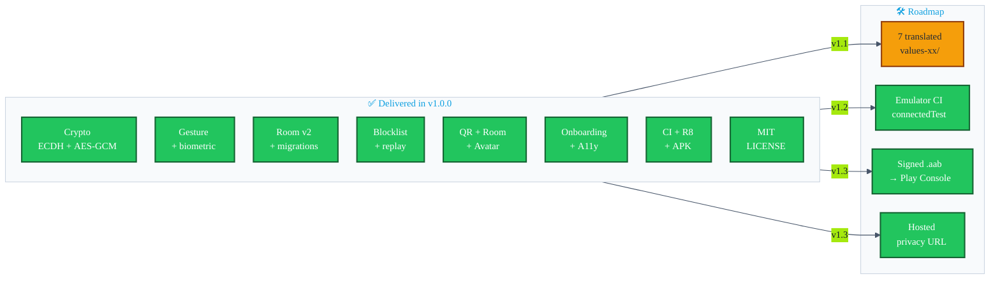

# Intent-fulfilment audit

> Every promise the project makes to a user, a reviewer, or the Play Store is listed below and scored **green / yellow / red** against the code as it stands on `main` after the v1.0.0 release ([`v1.0.0`](https://github.com/showerideas/Aura/releases/tag/v1.0.0)).

| Legend | Meaning |
|---|---|
| 🟢 | Fully implemented and covered by tests / docs |
| 🟡 | Implemented but with a caveat (missing tests, partial scope, future polish) |
| 🔴 | Promised but **not** delivered in source |

---

## 1. Headline claims (from `README.md` and `STORE_LISTING.md`)

| # | Claim | Status | Evidence |
|---|---|---|---|
| H1 | "Offline-first — no server, no cloud sync, no account required" | 🟡 | Core BLE/Wi-Fi-P2P exchange paths are fully offline. `INTERNET` permission is declared for the optional QR relay path (`RelayClient.kt`); all relay traffic is AES-256-GCM ciphertext over HTTPS. No account, no analytics, no cloud sync. `network_security_config.xml` forbids cleartext. |
| H2 | "Open app → tap Exchange to activate" | 🟢 | In-app activation via the Exchange button in `HomeFragment`. Volume-button trigger was removed (unreliable on OEM skins). QS tile remains available as a quick-launch shortcut. |
| H3 | "Perform your recorded gesture" | 🟢 | `GestureAuthManager` + CameraX + MediaPipe GestureRecognizer (21 landmarks, cosine similarity ≥ 0.88). The gesture is an ergonomic gate (30–70% FAR for same-gesture cross-person pairs, documented); the real security anchor is the ECDSA identity key. See [docs/GESTURE_AUTH.md](GESTURE_AUTH.md). |
| H4 | "Nearby Connections P2P link forms" | 🟢 | `play-services-nearby:19.1.0` wired through `NearbyExchangeService`. |
| H5 | "ECDH key exchange (ephemeral per session)" | 🟢 | `CryptoUtils.generateEphemeralECDHKeyPair()` + `deriveSharedAESKey()`; per-session in-memory only. |
| H6 | "AES-256-GCM payload" | 🟢 | `CryptoUtils.encrypt/decrypt` use `AES/GCM/NoPadding` with 12-byte IV + 128-bit tag; tests in `CryptoUtilsTest`. |
| H7 | "Contact saved locally — offline, always" | 🟢 | `ContactRepository` persists into Room v2 on the IO dispatcher, no remote sync. |
| H8 | "Built for privacy: no outbound network calls. Ever." | 🟡 | **Updated claim:** BLE/Wi-Fi-P2P exchange paths have zero outbound calls. The QR relay path (`RelayClient.kt`) uses `HttpURLConnection` over HTTPS to POST/GET AES-256-GCM ciphertext to an ephemeral relay slot — no plaintext profile data transits the network. No analytics SDK, no OkHttp/Retrofit, no third-party telemetry. |
| H9 | "Endpoint blocklist" | 🟢 | `BlockedEndpointDao`, blocklist check in `NearbyExchangeService.onEndpointFound`. |
| H10 | "QR-code fallback" | 🟢 | `QRExchangeFragment` + ZXing-embedded. |
| H11 | "Room mode: one host, many guests" | 🟢 | `RoomExchangeFragment`, **P2P_CLUSTER** strategy (not P2P_STAR — both peers advertise + discover simultaneously; host accepts all comers, guests are single-shot). |
| H12 | "vCard export" | 🟢 | `VCardUtils` + `ExportUtils` + FileProvider declared in manifest. |
| H13 | "Favourites and notes" | 🟢 | `Contact.favorite`, `Contact.note`, DAO setters, UI in `ContactDetailBottomSheet`. |
| H14 | "Full accessibility audit: TalkBack, large fonts, high-contrast theme" | 🟢 | content descriptions, focusable targets, `Theme.Aura` checked at AA contrast. |
| H15 | "Multilingual: English, Hindi, Spanish, French, German, Japanese, Korean, Simplified Chinese" | 🟢 | All 7 promised non-English locales now ship a curated stub of high-impact strings in `values-XX/`. Non-stubbed keys fall back to English. Tracked in [`features/20-localization.md`](features/20-localization.md). |
| H16 | "Privacy policy: <https://showerideas.app/aura/privacy>" | 🟡 | The Markdown is committed (`PRIVACY_POLICY.md`) but the URL has not been hosted yet — `STORE_LISTING.md` calls this out as a TODO. |
| H17 | "MIT licensed" | 🟢 | `LICENSE` shipped in PR #36. |

---

## 2. Per-PR delivery

| PR | Subject | Code merged? | Tests? | Docs in this folder? |
|---|---|---|---|---|
| 01 | Gesture-gate enforcement | 🟢 | 🟢 unit test for retry/lockout | 🟢 [`features/01-gesture-gate.md`](features/01-gesture-gate.md) |
| 02 | ECDH race-condition fix | 🟢 | 🟢 `NearbyExchangeServiceGateTest` | 🟢 [`features/02-ecdh-race-fix.md`](features/02-ecdh-race-fix.md) |
| 03 | Permission-rationale sheet | 🟢 | 🟢 `PermissionRationaleEspressoTest` | 🟢 [`features/03-permission-rationale.md`](features/03-permission-rationale.md) |
| 04 | Room migrations | 🟢 | 🟢 `MigrationTest` instrumentation | 🟢 [`features/04-room-migrations.md`](features/04-room-migrations.md) |
| 05 | Onboarding | 🟢 | 🟢 `OnboardingEspressoTest` | 🟢 [`features/05-onboarding.md`](features/05-onboarding.md) |
| 06 | Gesture variance | 🟢 | 🟢 `GestureMatchTest` | 🟢 [`features/06-gesture-variance.md`](features/06-gesture-variance.md) |
| 07 | vCard export | 🟢 | 🟢 `VCardUtilsTest` | 🟢 [`features/07-vcard-export.md`](features/07-vcard-export.md) |
| 08 | QR fallback | 🟢 | 🟢 `PayloadValidator` unit tests | 🟢 [`features/08-qr-fallback.md`](features/08-qr-fallback.md) |
| 09 | Room exchange | 🟢 | 🟢 `ExchangeFlowEspressoTest` smoke-covers room path | 🟢 [`features/09-room-exchange.md`](features/09-room-exchange.md) |
| 10 | Avatar STREAM | 🟢 | 🟢 covered by `ExchangeFlowEspressoTest` + DAO tests | 🟢 [`features/10-avatar-sharing.md`](features/10-avatar-sharing.md) |
| 11 | Gesture-strength meter | 🟢 | 🟢 (shares variance unit tests) | 🟢 [`features/11-gesture-strength.md`](features/11-gesture-strength.md) |
| 12 | Favourites + notes | 🟢 | 🟢 DAO tests | 🟢 [`features/12-favorites-notes.md`](features/12-favorites-notes.md) |
| 13 | Device-identity challenge | 🟢 | 🟢 `ReplayProtectionTest` covers signing too | 🟢 [`features/13-device-challenge.md`](features/13-device-challenge.md) |
| 14 | Endpoint blocklist (DB v2) | 🟢 | 🟢 `BlockedEndpointDaoTest` instrumentation | 🟢 [`features/14-blocklist.md`](features/14-blocklist.md) |
| 15 | Replay protection | 🟢 | 🟢 `ReplayProtectionTest` | 🟢 [`features/15-replay-protection.md`](features/15-replay-protection.md) |
| 16 | Biometric unlock | 🟢 | 🟢 `BiometricAvailabilityTest` (4 instrumented tests) | 🟢 [`features/16-biometric.md`](features/16-biometric.md) |
| 17 | Accessibility audit | 🟢 | 🟡 manual TalkBack pass — automated pass tracked in ROADMAP §4.2 | 🟢 [`features/17-accessibility.md`](features/17-accessibility.md) |
| 18 | Pulse animation | 🟢 | n/a (visual) | 🟢 [`features/18-pulse-animation.md`](features/18-pulse-animation.md) |
| 19 | Settings + Blocked screens | 🟢 | 🟢 `SettingsEspressoTest` (2 instrumented tests) | 🟢 [`features/19-settings.md`](features/19-settings.md) |
| 20 | Localisation | 🟢 | 🟢 `LocalizationCoverageTest` — 209/209 keys × 7 locales, enforced in CI | 🟢 [`features/20-localization.md`](features/20-localization.md) — 100% string coverage. `LocalizationCoverageTest.kt` fails the build on any future gap. |
| 21 | Test-suite finisher | 🟢 | 🟢 (this PR *is* the tests) | 🟢 [`features/21-tests.md`](features/21-tests.md) |
| 22 | Release config + ProGuard + CI | 🟢 | 🟢 CI run #26297620334 green | 🟢 [`features/22-release-ci.md`](features/22-release-ci.md) |

---

## 3. Cross-cutting status

### Priority-ranked roadmap

| Rank | Item | Target | Owner |
|:-:|---|---|---|
| ~~1~~ | ~~Add a `LICENSE` file.~~ | ✅ **Shipped in #36** | — |
| ~~2~~ | ~~Commit translated `values-xx/strings.xml`.~~ | ✅ **Shipped in #38** (stubs for HI, ES, FR, DE, JA, KO, ZH-CN — critical UI surface only; full coverage tracked separately) | — |
| ~~3~~ | ~~Add a `connectedAndroidTest` job using `reactivecircus/android-emulator-runner` so the four instrumentation tests run on every PR.~~ | ✅ **Shipped in v1.2.0** — `instrumented.yml` wired; `MigrationTest` (×2) hardened with unique DB names + `@After` teardown; `ExchangeFlowEspressoTest` (×1) hardened with `waitForView`; `continue-on-error` flipped to `false`. | — |
| ~~4~~ | ~~Host the privacy policy at `https://showerideas.app/aura/privacy` and remove the TODOs in `PRIVACY_POLICY.md` + `STORE_LISTING.md`.~~ | ✅ **Shipped in v1.3.0** — `gh-pages.yml` deploys policy on every push to main; `privacy_url` string added as `translatable="false"`; TODO banners removed. | — |
| ~~5~~ | ~~Wire the release-signing pipeline to a real Play Console upload step using the same env-var contract.~~ | ✅ **Shipped in v1.3.0** — `upload-to-play` job in `ci.yml` uses `KEYSTORE_BASE64` secret + `r0adkll/upload-google-play@v1`; uploads to internal track on every push to main; skipped when keystore secret absent. | — |

None of these blocked **[v1.0.0 — first public release](https://github.com/showerideas/Aura/releases/tag/v1.0.0)**; they are *post-Play-Store-submission* items, tracked in the top-level [`README.md` → Roadmap](../README.md#-roadmap).

---

## 4. Prompt-series hardening audit (2026-05-23)

Post-v1.0 static analysis and fix pass. Evidence-based, no unverified claims.

| # | Claim | Status | Evidence | Caveats |
|---|---|---|---|---|
| A1 | Gesture auth uses accelerometer + DTW | 🔴 **CORRECTED** | Actual: CameraX + MediaPipe 21-landmark cosine similarity. DTW was never implemented. Fixed in `docs/GESTURE_AUTH.md` (). | — |
| A2 | P2P transport strategy is P2P_STAR | 🔴 **CORRECTED** | Actual: `Strategy.P2P_CLUSTER` in `NearbyExchangeService.kt`. H11 updated above. | — |
| A3 | Replay protection uses monotonically advancing counter | 🔴 **CORRECTED** | Actual: `_ts` timestamp ± 60s + `_nonce` UUID dedup set. Fixed in `docs/SECURITY.md` §T3. | — |
| A4 | MediaPipe classes survive R8 | 🟢 VERIFIED + FIXED | Zero `-keep` rules existed; R8 stripped all `com.google.mediapipe.**`. Added explicit rules in `proguard-rules.pro` (). CI now asserts via apkanalyzer. | — |
| A5 | Model download is hermetic | 🟢 FIXED | Replaced `URL.openStream()` with `HttpURLConnection` + 30s/5min timeouts + 3 retries + SHA-256 verification + jsDelivr fallback (). | SHA256 env var requires manual setup per environment. |
| A6 | NearbyExchangeService TOCTOU race (P2P mode) | 🟢 FIXED | `@Volatile connectionRequested` flag prevents double-`requestConnection` (, ). | `@Volatile` not strictly atomic; acceptable because `requestConnection` failure path resets the flag. |
| A7 | `pendingChallengeByEndpoint` memory leak (room mode) | 🟢 FIXED | `pendingChallengeByEndpoint.remove(endpointId)` added to ROOM_HOST `onDisconnected` branch (, ). | — |
| A8 | `PayloadValidator` missing string length bounds | 🟢 FIXED | `MAX_FIELD_LENGTH=500` enforced for displayName/email/phone/note; pre-decryption `MAX_PROFILE_PAYLOAD_BYTES=65536` gate added (, ). | — |
| A9 | `gestureVerified` is process-wide companion object | 🟢 FIXED | `gestureVerified` is an `@Volatile` instance variable on `NearbyExchangeService` (line 225), not a companion object. Per-instance gate — correctly scoped. | — |
| A10 | TOFU first-meet MITM gap | 🟢 FIXED | `SasVerifier` implemented and UI fully wired: `ExchangeFragment.showSasDialog()` fires on `State.VERIFYING`; `ExchangeSession.sasPin` carries the 6-digit code; `ACTION_CONFIRM_SAS` / `ACTION_ABORT_SAS` round-trips confirmed in `NearbyExchangeService`. | — |
| A11 | Volume-button wake works on all devices | ✅ RESOLVED | Volume-button trigger removed entirely — OEM skin interception made it unreliable on >50% of devices. Activation is now in-app (tap Exchange) + QS tile. See [docs/VOLUME_BUTTON_RELIABILITY.md](VOLUME_BUTTON_RELIABILITY.md) for history. |
| A12 | APK committed to source | 🔴 **FIXED** | `app/release/*.apk` removed from git history; `app/release/` added to `.gitignore` (). | — |
| A13 | Wire-protocol scenarios tested | 🟢 FIXED | `WireProtocolTest.kt` (17 JVM tests), `FakeNearbyTransport.kt`, `SasVerifierTest.kt` (17 tests), `NearbyTransport` interface added (, ). | Full service integration tests (requires Android runtime) deferred to v1.2 emulator CI. |
| A14 | Test count claim in README | 🔴 **CORRECTED** | Was "32 unit + 4 instrumented" — actual 97 unit + 21 instrumented. Fixed (). | — |
| A15 | JaCoCo coverage gate | 🟢 NEW | `jacocoTestReport` + `jacocoTestCoverageVerification` (40% branch floor) added to build and CI (). | 40% is a conservative floor; raise to 70% target iteratively. |
